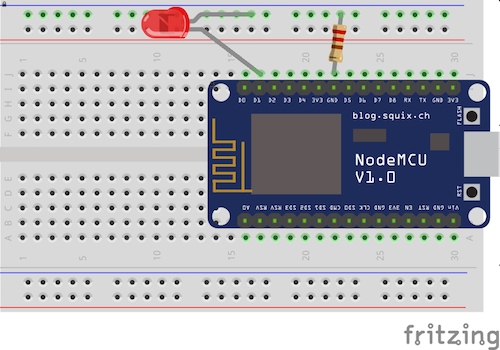

# Blink the LED

## Parts needed
- NodeMCU
- 220ohm resistor
- Any colored LED

## How to connect
Connect the long leg (+) of the LED to the digital pin D1. Connect the short leg (-) to one end of the resistor. Connect the other end of the resistor to one of the pins named GND.




## Code
```Arduino
// the setup function runs once when you press reset or power the board
void setup() {
  // initialize digital pin D1 as an output.
  pinMode(D1, OUTPUT);
}

// the loop function runs over and over again forever
void loop() {
  digitalWrite(D1, HIGH);   // turn the LED on
  delay(1000);              // wait for a second
  digitalWrite(D1, LOW);    // turn the LED off
  delay(1000);              // wait for a second
}
```
