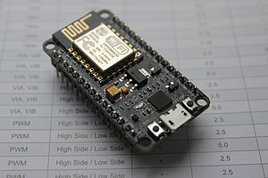
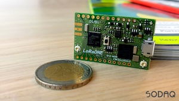
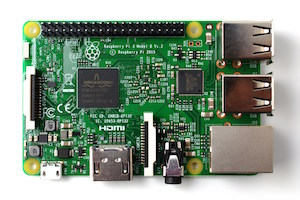

#Available Hardware
The IoT Lab has some hardware that you can borrow for hacking purposes. Please give it back if you are not using it :)

##Development boards
A development board is a product that professionals use to evaluate a certain chip. As an example, the NodeMCU below is a development board for the ESP8266 module (the thing on top with an antenna and a metal can). If the chip suits the needs, the development board can be used to create the first prototypes of a commercial product. Makers also use them for the same purposes, often making more permanent project based around them.

###NodeMCU (WiFi)
We have 10 NodeMCU boards with WiFi capability. There are also lot of different sensors available, see separate list below. We reccomend programming it with the Arduino-compatible software [PlatformIO](https://platformio.org). You will find lots of code examples and libraries online.

###Sodaq One (LoRa)
We have 10 Sodac One kits. The kits also include batteries, solar cells and GPS antennas. See the [Kickstarter page](https://www.kickstarter.com/projects/sodaq/loraone-the-lora-iot-development-board/description) for more details.

###Raspberry Pi (WiFi, Bluetooth)
We have a few of the well known single board computer Raspberry Pi 3. Just to name a few features, the Pi runs full Linux, has WiFi, Bluetooth, HDMI, ethernet and programmable pins. You write programs in any language you prefer and find lots of examples online. We also have one of the official camera modules that connects straight to the board.

##Sensors
Input or measurement devices that that can be hooked up to a development board:

* BME280 combined air temperature, pressure and humidity sensor
* Temperature sensors
* RFID sensor
* Reed switch (magnet sensor)
* Hall effect sensor (magnet sensor)
* Solar panel
* Motion sensor
* Potentiometer (variable resistor)
* Water level sensor
* Soil moisture sensor

##Actuators
Output or presentation devices that can be hooked up to a development board:

* Water pump
* LED (white, red, green, yellow)
* Servo motor
* Display 0.96" (mounted in Telia Town Station)